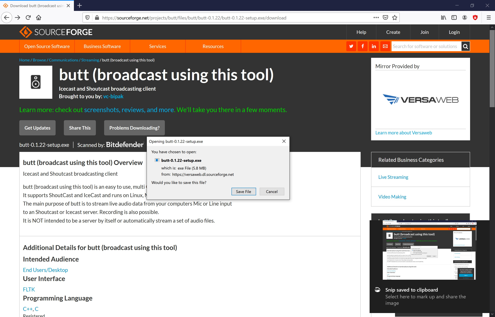
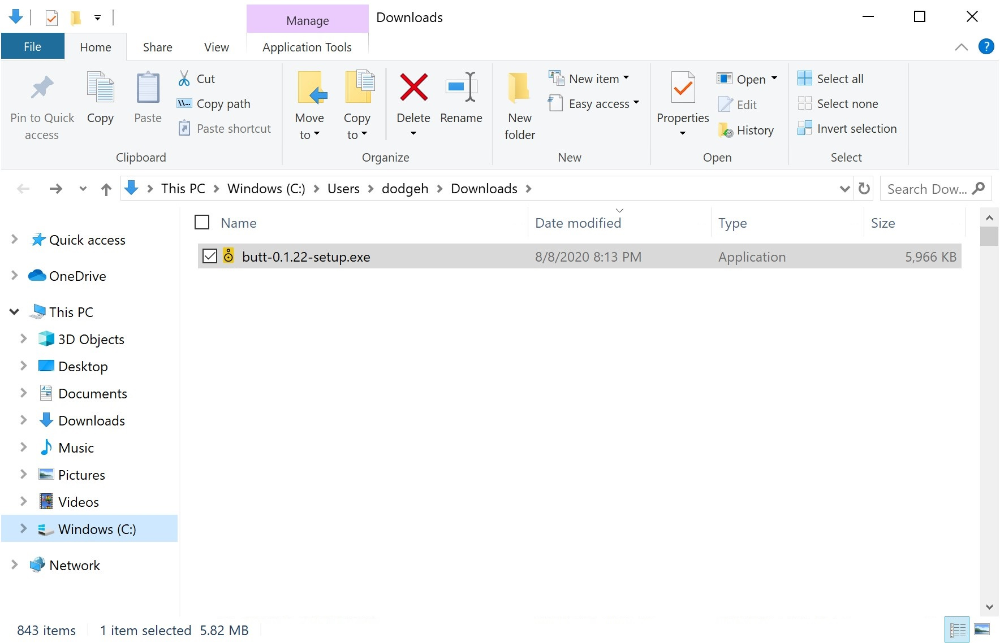
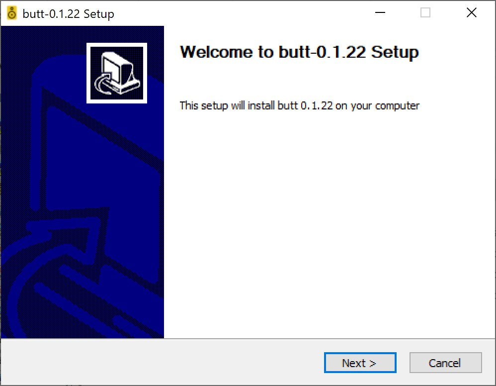
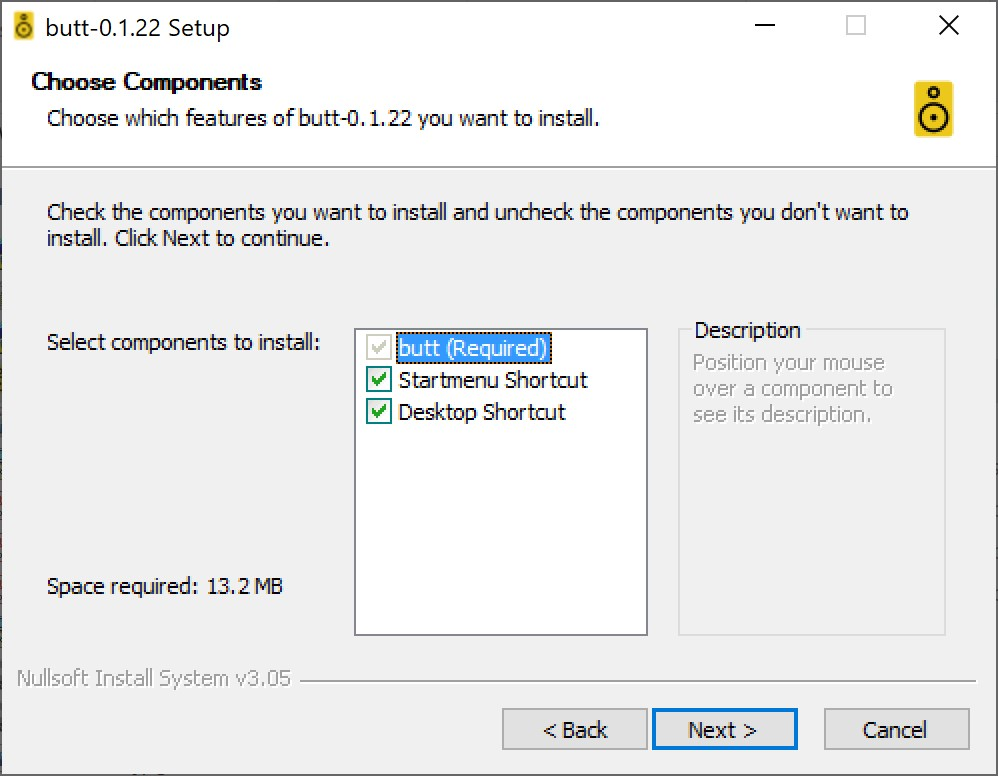
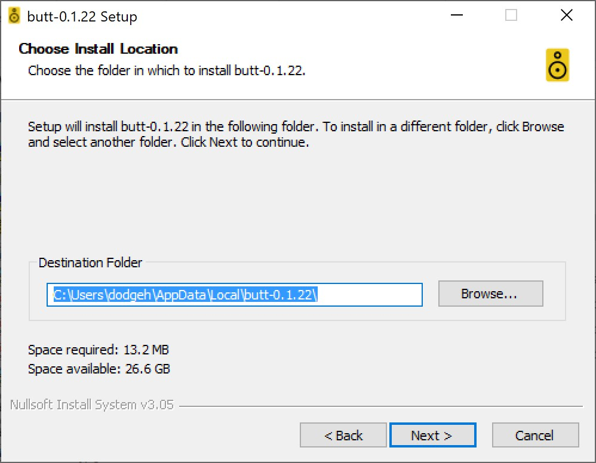
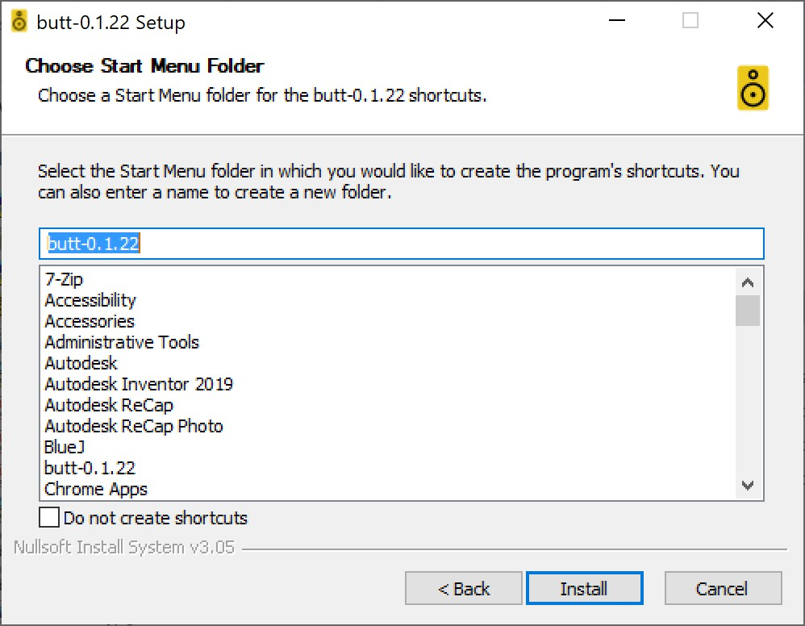
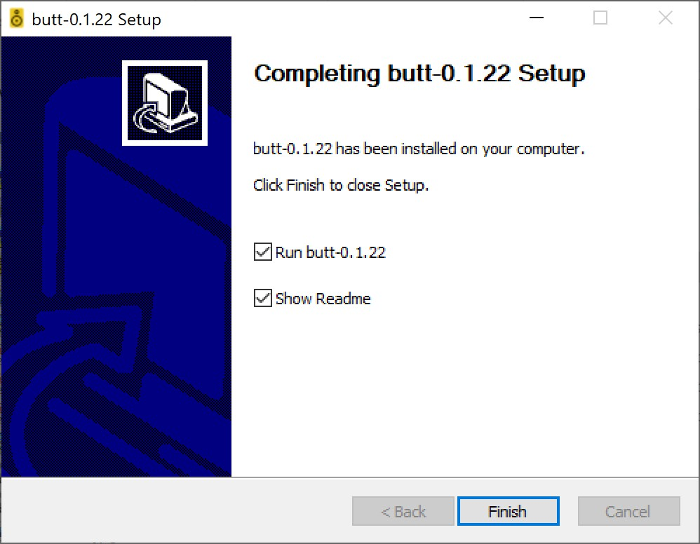
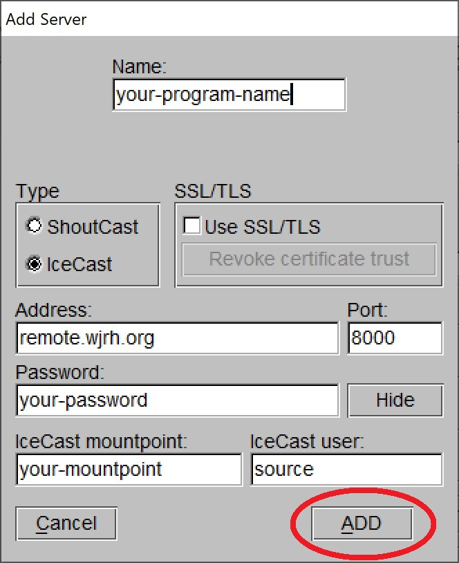
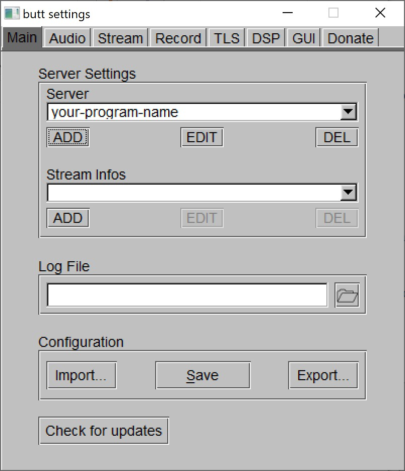

# WJRH Remote Broadcasting
WJRH Engineering has enabled DJs to broadcast remotely. This guide provides setup instructions and recommendations for broadcasting a remote live show to WJRH 104.9 FM. 

## How It Works
WJRH Engineering has setup an Icecast server to host remote broadcasts. Icecast is an open source streaming standard that is widely used among internet radio broadcsters. More information about Icecast can be found at [https://icecast.org/](https://icecast.org/). 

The Icecast server is the intermediary between stream source and listeners stream. To provide audio to the Icecast server, DJs will need to create a stream with an Icecast client source. The Icecast client source will direct your audio to your program's mountpoint on the Icecast server. Once directed to the Icecast server, listeners can hear your audio stream and WJRH can relay your show to the main station during your scheduled timeslot.

DJs may remotely broadcast an internet program at any time. Remote broadcasts will only be relayed to the main station during your scheduled program time slot.

This guide will provide setup instructions to create Icecast sources on your computer for use in broadcasting to WJRH. The instructions in this guide have been tested by WJRH Engineering. DJs are free to use any method to create Icecast sources.

## Setup
In order to broadcast remotely, DJs must be able to create Icecast sources. This is done using an Icecast soruce client. There are many Icecast source client. The options discussed in this guide have been tested by WJRH Engineering and were selected for general usage. DJs may use whatever Icecast source client they prefer. Addtional Icecast source clients are listed at [https://icecast.org/apps/](https://icecast.org/apps/).

Note that only one person may connect to a mountpoint on the Icecast server at a time. You will need to coordinate with the members of yoour program to decide who will generate the Icecast source for each episode. The person generating the Icecast source will be referred to as the broadcaster. Audio from colloborators will need to be added to the mix by the broadcaster.

### Icecast Mount Point Settings
Every program will have a uniquie mount point. Use the following settings in your Icecast souce client.

|Setting|Value|
|-------|-----|
|server|remote.wjrh.org|
|port|8000|
|mountpoint|*Program shortname (Teal API)*|
|username|source|
|password|*Provided by WJRH Engineering*|

WJRH Engineering will provide mount, username, and password to broadcasters upon request.

### Recommended Icecast Source Client
WJRH Engineering recommends the broadcast using this tool (butt) program as your Icecast Source Client for generating an Icecast source. Butt is available for Windows, Mac, and Linux. 

1. Please download butt at [https://danielnoethen.de/butt/](https://danielnoethen.de/butt/). 

2. Install butt. The default installation is acceptable. Images shown are an example installation for Windows.

3. Run butt if not launched after installation.

4. Open butt Settings. Choose the Main tab.

5. To add the WJRH Icecast server, click ADD under the Server selection dropdown in the Server Settings section. A blank form to add server information will open.

6. Choose the IceCast option under Type. Fill out the server information as shown in the table below and the following picture. Replacing your-program-name, your-mountpoint, and your-password with your actual program name, mountpoint, and password. This information was provided to you by WJRH Engineering when you signed up for a program. If you are unsure about this information, please contact WJRH Engineering.

|Setting|Value|Value in Example|
|-------|-----|----------------|
|server|remote.wjrh.org|remote.wjrh.org|
|port|8000|8000|
|mountpoint|*Program shortname (Teal API)*|your-mountpoint|
|username|source|source|
|password|*Provided by WJRH Engineering*|your-password|

7. When finished, click ADD. You will return to the butt settings.

8.

9.

If you have more than one program, add more servers and stream infos using steps 4 through 7 (X).

By default, butt will only broadcast audio input devices, such as the built in microphone on your computer. To broadcast from audio programs on your computer (e.g. Spotify), a virtual mixer will need to be used.

### Recommended Virtual Mixer

#### Windows 
WJRH Engineering recommends using VoiceMeeter as the virutal mixer. 

Download VoiceMeeter at [https://www.vb-audio.com/Voicemeeter/](https://www.vb-audio.com/Voicemeeter/).

A more complex version of VoiceMeeter Banana is a more complex version of VoiceMeeter that provides additional audio inputs and outputs. It can be downloaded at [https://www.vb-audio.com/Voicemeeter/banana.htm](https://www.vb-audio.com/Voicemeeter/banana.htm).

### Optional
[https://www.vb-audio.com/Cable/index.htm](https://www.vb-audio.com/Cable/index.htm)

## Examples
WJRH Engineering knows that all shows are different. Here are some recommended ways to implement common show elements using the recommended setup on a Windows Computer.

### Case 1 - Computer Audio Output
Icecast Source Client: butt
Virtual Mixer: VoiceMeeter

Audio Inputs
- Computer Audio Output

Audio Outputs
- Main mix for Icecast source
- Audio for Broadcaster (speakers/headphones)

### Case 2 - Single Microphone
Icecast Source Client: butt
Virtual Mixer: VoiceMeeter

Audio Inputs
- Broadcaster Microphone

Audio Outputs
- Main mix for Icecast source
- Audio for Broadcaster (headphones)

### Case 3 - Single Microphone with Computer Audio Output
Icecast Source Client: butt
Virtual Mixer: VoiceMeeter

Audio Inputs
- Broadcaster Microphone
- Computer Audio Outout

Audio Outputs
- Main mix for Icecast source
- Audio for Broadcaster (headphones)

### Case 4 - Single Microphone with Program Specific Audio Channel
Icecast Source Client: butt
Virtual Mixer: VoiceMeeter + Virtual Audio Cable

Audio Inputs
- Broadcaster Microphone
- Program Audio Output

Audio Outputs
- Main mix for Icecast source
- Audio for Broadcaster (headphones)

### Case 5 - Single Microphone with Collaborator Skype Audio
This setup will show how to create a mix in VoiceMeeter to support collaborators over Skype.

Icecast Source Client: butt
Virtual Mixer: VoiceMeeter Banana + Virtual Audio Cable

Audio Inputs
- Broadcaster Microphone
- Skype Audio Output

Audio Outputs
- Main mix for Icecast source
- Audio for Broadcaster (headphones)
- Audio for Skype Collaborators

### Case 6 - Single Microphone with Collaborator Audio and Program Specific (may be only able to do computer audio output for free (can be done if buying the dual virtual audio cable) Audio Channel 

## Recording & Song Logging
We will continue to use Teal to record shows and log songs. If your will be remote streaming to the main station, Teal will work exactly the same if you were in the studio in Hogg Hall and your recording will be available automatically on Teal.

All remote streams will be recorded reguardless of whether they are relayed to the main station. Contact WJRH Engineering for a copy of remote broadcast. PLease include your show's name, the mountpoint used, and date and time of broadcast.
